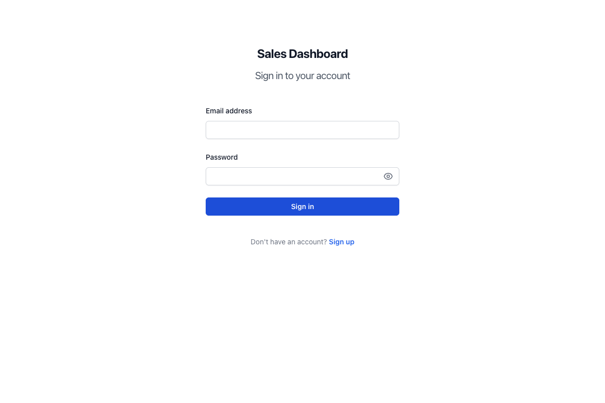
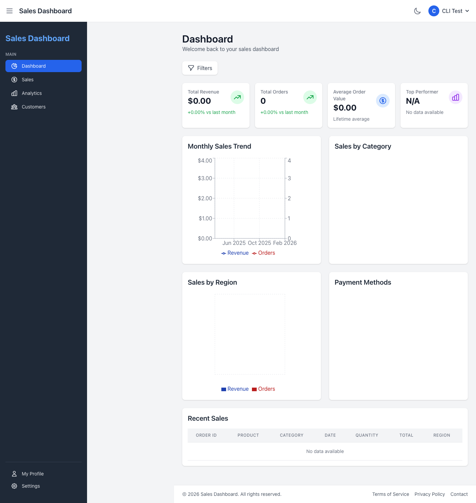

# Sales Dashboard

A full-stack **MERN** sales analytics dashboard. Users register, log in, record sales, and view live KPIs, charts, and a paginated, filterable sales table. Authentication is JWT-based using **httpOnly cookies** with **CSRF protection**, and access is **role-based** (regular users see only their own sales; admins see everything).

> Built as a portfolio project to demonstrate full-stack architecture, secure authentication, REST API design, and data visualization.

## Tech Stack

| Layer | Technology |
| --- | --- |
| Frontend | React 18 (Vite), Redux Toolkit, React Router 6, Recharts, Tailwind CSS |
| Backend | Node.js, Express 4 |
| Database | MongoDB with Mongoose 7 |
| Auth | JSON Web Tokens in httpOnly cookies, bcrypt password hashing, double-submit CSRF tokens |
| Tooling | Vite, ESLint, Docker / docker-compose, GitHub Actions CI |

## Screenshots

> The images below are placeholders in `docs/screenshots/`. Replace them with real captures (keep the same filenames) to have them render here.

| Login / Signup | Dashboard | Charts & Table |
| --- | --- | --- |
|  |  |  |

## Features

- Email/password authentication with hashed passwords (bcrypt) and JWTs stored in httpOnly cookies.
- CSRF protection via the double-submit cookie pattern on all state-changing requests.
- Role-based authorization (`user` vs `admin`) enforced in middleware and reflected in the UI.
- Full CRUD for sales records with ownership checks.
- Filtering (category, region, payment method, date range), sorting, and pagination.
- Aggregated analytics endpoint powering KPI cards plus category, region, payment-method, and 12-month trend charts.
- Centralized error handling and a consistent JSON response envelope.
- Dark mode and responsive layout.
- Optional live demo seeder (node-cron) that generates evolving sales on a schedule, so a deployed instance keeps changing on its own.
- `/health` endpoint for uptime monitoring and platform health checks.

## Architecture

### Authentication flow

1. On register/login the server signs a JWT (`{ id, role }`) and sets it as an **httpOnly** cookie (`token`). The token is never exposed to JavaScript, mitigating XSS token theft.
2. The `protect` middleware reads the JWT from the cookie (falling back to an `Authorization: Bearer` header so API clients like Postman still work), verifies it, and loads the user.
3. `authorize('admin')` gates admin-only routes.
4. **CSRF:** the server issues a readable `csrfToken` cookie; the SPA echoes it back in an `X-CSRF-Token` header on every mutating request, and `verifyCsrf` confirms the two match.
5. The React app determines auth state on load by calling `GET /api/auth/me` (the cookie travels automatically with `withCredentials`).

### Data models

- **User** — `name`, `email` (unique), `role` (`user` | `admin`), `password` (hashed, `select: false`).
- **Sale** — `orderId`, `product`, `category`, `price`, `quantity`, `totalAmount`, `date`, `region`, `paymentMethod`, `customer` → User, `createdBy` → User. Indexed on `{ customer, date }`, with a `profit` virtual.

### Project structure

```
server/
  config/        # db connection
  controllers/   # auth, sales, user business logic
  jobs/          # live demo seeder (node-cron)
  middleware/    # auth (protect/authorize), csrf, asyncHandler, errorHandler
  models/        # Mongoose schemas
  routes/        # Express routers
  utils/         # shared sample data, cookie options
  index.js       # app entry
  seed.js        # interactive data seeder
src/
  components/    # UI (Auth, Dashboard, Charts, etc.)
  redux/         # store + slices (auth, sales, ui)
  hooks/         # useDashboardData
  utils/         # api client, formatters, chart helpers
public/          # static assets
scripts/         # smoke-test.js (end-to-end API check)
```

## API Reference

All `/api/sales` and `/api/users` routes require authentication. `/api/users` additionally requires the `admin` role.

| Method | Endpoint | Description | Access |
| --- | --- | --- | --- |
| GET | `/health` | Health check (status + uptime) | Public |
| GET | `/api/auth/csrf` | Issue a CSRF token | Public |
| POST | `/api/auth/register` | Register and receive auth cookie | Public |
| POST | `/api/auth/login` | Log in and receive auth cookie | Public |
| GET | `/api/auth/me` | Current user | Private |
| POST | `/api/auth/logout` | Clear auth cookie | Private |
| GET | `/api/sales` | List sales (filter/sort/paginate) | Private |
| GET | `/api/sales/stats` | Aggregated dashboard stats | Private |
| GET | `/api/sales/:id` | Single sale | Private (owner/admin) |
| POST | `/api/sales` | Create sale | Private |
| PUT | `/api/sales/:id` | Update sale | Private (owner/admin) |
| DELETE | `/api/sales/:id` | Delete sale | Private (owner/admin) |
| GET | `/api/users` | List users | Admin |
| POST | `/api/users` | Create user | Admin |
| GET | `/api/users/:id` | Single user | Admin |
| PUT | `/api/users/:id` | Update user | Admin |
| DELETE | `/api/users/:id` | Delete user | Admin |
| GET | `/api/users/:id/sales` | A user's sales | Admin |

## Getting Started

### Prerequisites

- Node.js 18+
- A MongoDB instance (local, or a free [MongoDB Atlas](https://www.mongodb.com/atlas) cluster)

### 1. Install

```bash
npm install
```

### 2. Configure environment

Create `server/.env` (see `server/.env.example`):

```
NODE_ENV=development
PORT=5001
MONGO_URI=mongodb://localhost:27017/sales-dashboard
JWT_SECRET=replace_with_a_long_random_string
JWT_EXPIRE=30d
JWT_COOKIE_EXPIRE=30
CORS_ORIGIN=http://localhost:3000
```

The frontend reads its API URL from `.env.development` / `.env.production` (`VITE_API_URL`). Vite only exposes variables prefixed with `VITE_` to the browser build.

> **Never commit real secrets.** `server/.env` is gitignored. Generate a strong `JWT_SECRET`, e.g. `node -e "console.log(require('crypto').randomBytes(48).toString('hex'))"`.

### 3. Seed data (optional)

```bash
npm run seed
```

### 4. Run

```bash
# Backend (port 5001) and frontend Vite dev server (port 3000) together
npm run dev

# or separately
npm run server
npm start
```

## Available Scripts

| Script | Description |
| --- | --- |
| `npm run dev` | Run backend + frontend concurrently |
| `npm run server` | Run the Express API |
| `npm start` | Run the Vite dev server |
| `npm run build` | Production build of the frontend (outputs to `dist/`) |
| `npm run preview` | Preview the production build locally |
| `npm run seed` | Seed users and sales |
| `npm run lint` | Lint the codebase |
| `npm test` | Run tests |

With the backend running, `node scripts/smoke-test.js` exercises the full API end to end (register → login → create/list/delete sale → stats, plus CSRF and auth guard checks).

## Deployment

The app runs entirely on free tiers: **MongoDB Atlas** (database), **Render** (Express API), and **Vercel** (React frontend). Because the frontend and API are on different domains, auth cookies are sent cross-site as `SameSite=None; Secure` in production — this is handled in code, you just set the env vars.

Key configuration: set `CORS_ORIGIN` (on the API) to the deployed frontend URL, and `VITE_API_URL` (on the frontend) to the deployed API URL. Render's free web service cold-starts after ~15 minutes idle; an uptime pinger against `/health` keeps it warm so the live seeder keeps running.

Repo includes `render.yaml` (API blueprint) and `vercel.json` (frontend config). **See [DEPLOYMENT.md](DEPLOYMENT.md) for the full step-by-step walkthrough.**

### Live demo seeder

Set `ENABLE_LIVE_SEED=true` to have the API insert a few fresh sales every couple of minutes (configurable via `SEED_CRON`), attributed to a dedicated demo account, so a deployed instance visibly changes over time. The dataset self-trims at `SEED_MAX_SALES` to stay within the free Atlas tier. See `server/.env.example` for all seeder options.

## Security Notes

- JWTs are stored in httpOnly cookies (`SameSite=Lax` in dev, `SameSite=None; Secure` in production for cross-site requests) — never in `localStorage`.
- All mutating requests are CSRF-protected via the double-submit cookie pattern.
- Passwords are hashed with bcrypt and never returned by the API.
- CORS is locked to a configured origin with credentials enabled.
- All secrets are supplied via environment variables.

## License

Released for portfolio/demo purposes.
